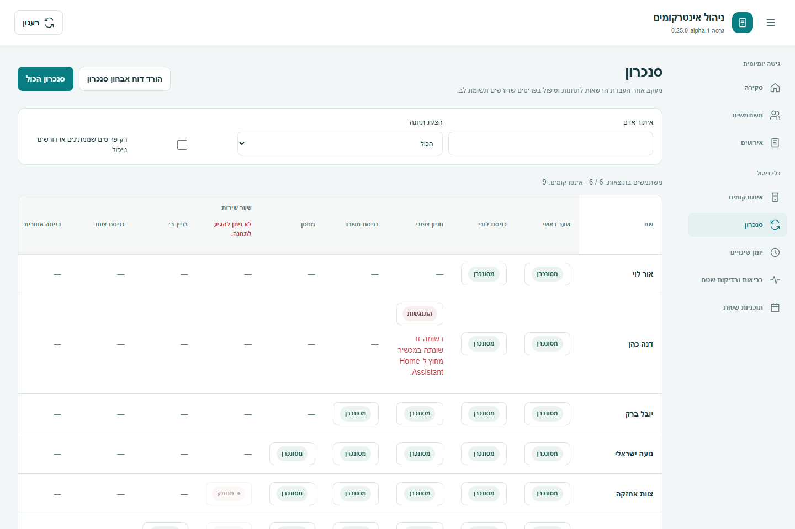

# מסירת ממשק הניהול — 0.25.0-alpha.1

תאריך: 2026-09-09. המשך [תוכנית 95%](ROADMAP_95_AND_UI_HE.md), משימות C3/C5/C6,
על בסיס [מסירת 0.24](CORE_UI_024_HE.md). הבעלים ביקש להמשיך בפיתוח בזמן שבדיקת ההתקנה ממתינה.

## מה השתנה למשתמש

| מסך | התוצאה |
| --- | --- |
| משתמשים | הוספת אדם היא הפעולה הראשית; חיפוש וכלי ייבוא/סנכרון מקובצים; פעולות בשורה נעטפות, וכרטיסי הנייד משתמשים בסגנון המעודכן. |
| סינון משתמשים | אין תוצאות מסינון אינו מוצג עוד כמאגר ריק. ניקוי מסננים מחזיר את הרשימה, משאיר את המיון ומאפס בחירה קבוצתית. |
| תוקף משתמש | משתמש ללא גבולות זמן מוצג ללא קידומת אזור זמן מיותרת. בתוקף מוגבל נשארים האזור והגבולות. אין שינוי באכיפה. |
| סנכרון | חיפוש אדם, בחירת תחנה והתמקדות בפריטים שאינם מסונכרנים או שיש בהם שגיאה. הסינון מקומי ואינו שולח פעולות לציוד. |
| סנכרון במחשב | מטריצה נגללת עם כותרות ושמות קבועים, לשמירת הקשר בין אדם לתחנה. |
| סנכרון בנייד | כרטיס לכל אדם עם שמות התחנות, מצב וכפתור הבירור הקיים. תחנות ללא שיוך מוסתרות בכרטיס; טבלת המחשב ממשיכה להציגן. |
| הסרות ממתינות | נשארות נגישות מתחת לרשימה גם אם הסינון לא מחזיר משתמשים. |
| אירועים | מבנה ברור של פעולה, זמן, תחנה ואדם; חותמות מבודדות בכיווניות RTL. נוסף מספר הרשומות שנטענו ורענון מפורש. |
| סינון אירועים | הודעה כאשר נערכו מסננים שטרם הוחלו. דוחות עדיין משתמשים במסננים שהוחלו לאחרונה; ניקוי מסננים מבטל תוצאת דוח מאוחרת ומחזיר את הרשימה. |
| יומן שינויים | אדם, פעולה, מנהל מבצע וזמן מופיעים בקדמת הרשומה. הערכים לפני ואחרי נפתחים לפי הצורך, גם באמצעות מקלדת. מוצג מספר נטען מול מספר תוצאות. |
| כרטיסי תחנות | תוקן ריווח במסך התחנות שהושפע מסגנון כרטיסי הסקירה ב־0.24. |

המסכים משתמשים בסגנונות משותפים ובצבעי HA, בעברית/אנגלית ובמצב בהיר/כהה. פרטי אירועים,
השוואות, ייצוא, פעולות משתמשים, בדיקת הרשאות ופתרון התנגשויות נשארו זמינים.
לא נוספו מסלולי ISAPI, לא שונו הרשאות בפועל ולא הופעל ציוד במהלך חבילה זו.

## תצוגות

התמונות נוצרו מרכיבי המוצר עם נתוני הדגמה; אין בהן נתוני הבעלים או צילום חי.

[משתמשים במחשב](images/025-users-desktop-he.png) ·
[משתמשים בנייד](images/025-users-mobile-he.png) ·
[סנכרון במחשב](images/025-sync-desktop-he.png) ·
[סנכרון בנייד](images/025-sync-mobile-he.png) ·
[אירועים במחשב](images/025-events-desktop-he.png) ·
[יומן שינויים בנייד](images/025-audit-mobile-he.png) ·
[אירועים במצב כהה](images/025-events-desktop-en-dark.png)

## בדיקות ומסירה

בדיקות ממוקדות עברו לסינון מקומי בסנכרון, שמירת כל אפשרויות התחנות, זמינות ההסרות,
ניקוי מסנני משתמשים, הבחנה בין סינון שנערך והוחל, שמירת סינון הייצוא, פרטי יומן באמצעות
מקלדת ותצוגות 390/768/1440 פיקסלים. נבדק שהפעולות הללו אינן שולחות שינוי הרשאות או סנכרון.
בדיקת הסינון החדשה השתמשה תחילה בתפקיד textbox במקום searchbox; תוקן המאתר ונבדק מחדש.

145 בדיקות הדפדפן המלאות עברו, לצד TypeScript, Prettier, Ruff ושמונה בדיקות כלי האריזה.
פורסמה [v0.25.0-alpha.1](https://github.com/jonioliel/home-assistant-hikvision-intercom/releases/tag/v0.25.0-alpha.1)
מהקומיט `10f9d43311661a81124cd20bc8e49b9581729a98`.
[הרצת השחרור 34390267958](https://github.com/jonioliel/home-assistant-hikvision-intercom/actions/runs/34390267958)
עברה בכל שבע העבודות: 838 בדיקות Python בכל אחת מגרסאות 3.12/3.14, 238 בדיקות HA,
145 בדיקות דפדפן, mypy ל־56 קבצים, Ruff, TypeScript, Prettier, שחזור bundle, HACS ו־Hassfest.

אחרי הפרסום אומתו התג מול הקומיט, גרסת manifest, קובצי המקור והמסירה וה־bundle
בגודל 1,048,941 בתים. תיקיות המידע הפרטי אינן בתג. הגרסה היא prerelease במסלול HACS
הקיים. בדיקת התקנה ושימושיות אצל הבעלים עדיין ממתינה.

השדרוג מ־0.24 שומר על סכמה 3 ועל מעטפת HA Store גרסה 1. אחרי עדכון HACS יש לאתחל HA
ולרענן את הדפדפן. יש לשמור גיבוי HA לפני שדרוג, כמתועד בגרסאות הקודמות.

## מצב התוכנית וההמשך

C5 התקדם בכל ארבעת מסכי הניהול: משתמשים, אירועים, סנכרון ויומן. C3 הורחב בסגנונות
משותפים למסכי הרשומות; C6 כולל בדיקות אוטומטיות וסקירה חזותית של המסכים שנמסרו.
קבלת השימושיות של הבעלים וההתאמות בעקבותיה עדיין פתוחות. אין סימון של כל העיצוב כמאושר.

השלב הבא במסלול העיצוב הוא משוב על שלושת התהליכים: פתיחת דלת/צפייה, ניהול אדם ובירור
כשל גישה או סנכרון. במסלול הליבה נשארים בירור זהות האירוע המקורי, תוקף מוגבל בזמן,
צלצול ושיחה, שמע, כרטיסים ובדיקת צי תשע תחנות, כמפורט בתוכנית.
לא נבדק WebRTC בהתקנה: דיווח הבעלים על MSE ועל NAT הממתין לטיפול נשאר בתוקף.

ספירת הקבלה נשארת **31/38 = 81.6%**. Phase 5 נשאר **8/9 = 88.9%**.
Phase 6 נשאר עם ארבע יכולות ממומשות בתוכנה, שלוש חלקיות ושתיים חסרות.
המדד המשולב הוא **36.5/47 = 77.7%**, ו־22.3% נותרו באותו מכנה. עבודת ממשק אינה
מחליפה את שבעת סעיפי הקבלה הפתוחים; יעד 95.7% עדיין מותנה בראיות המפורטות בתוכנית.
