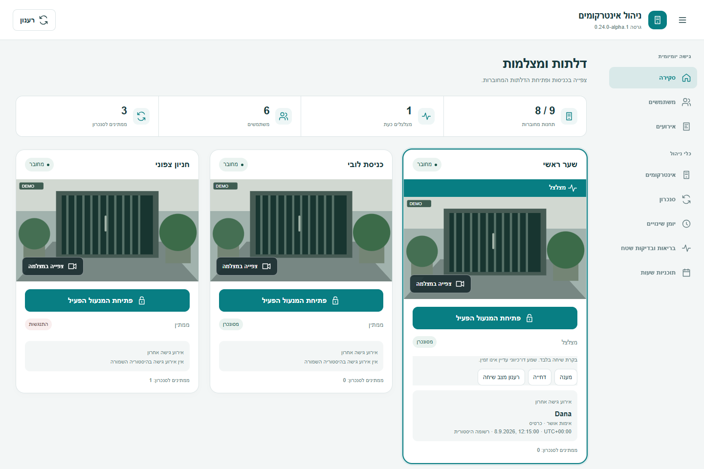

# מסירת ליבה וממשק — 0.24.0-alpha.1

תאריך: 2026-09-09. המשך [תוכנית 95% והעיצוב](ROADMAP_95_AND_UI_HE.md), על בסיס
0.23 וסכמת גישה 3. זהו עדכון ממשק ותיקוני זהות אירוע; תנאי קבלה פיזיים אינם נסגרים מכוח העיצוב.

## מה נמסר

- ניווט יומי: סקירה, משתמשים ואירועים. יתר מסכי הניהול נגישים בקבוצה נפרדת.
  במחשב יש סרגל צד, ובנייד שתי שורות ניווט, כאשר קבוצת הניהול נגללת לפי הצורך.
- מסך ראשי חדש: סיכום צי מרוכז, מצלמה רחבה וכפתור פתיחה לפני היסטוריית הגישה.
  צלצול מדגיש את התחנה; תור סנכרון אינו קובע אם מותר לפתוח דלת אחרת.
- פקדי שיחה תמציתיים בתחנה פעילה, בהתאם למצב המדווח. במסך המצלמה נשמרים הפקדים
  המלאים. התצוגה מבהירה ששמע דו־כיווני טרם זמין.
- חלון משתמש חדש: פרטים אישיים, תוקף, PIN, כרטיסים ושיוך תחנות בקבוצות ברורות;
  פעולות שמירה וביטול נשארות בתחתית בעוד השדות נגללים. השם בכותרת מתעדכן בעת הקלדה.
- רכיבי סגנון ואייקוני SVG מקומיים, ערכות HA בהירה וכהה, RTL/LTR והתאמה למחשב ולנייד.
- תיקון נרמול `employeeNo`: מחרוזת נשמרת בדיוק, לרבות אפסים בתחילתה. שדה
  `employeeNoString` מפורש ממשיך לקבל קדימות. אין התאמה לפי PIN, סיומת כרטיס או זמן סמוך.
- תיקון השלמת שם חסר: נדרש שיוך בעלות שנצפה בתחנה המסוימת, מזהה מדויק ואירוע שאינו
  מוקדם מהקמת הרשומה המרכזית. כוונת יצירה שטרם אומתה אינה מספיקה. שם שהציוד מספק נשמר.
  השיוך הנוכחי אינו הוכחה לכל היסטוריית הבעלות; לא הומצאו חותמות שיוך היסטוריות.

## תצוגות לבחינת העיצוב

התמונות מציגות את רכיבי המוצר עם נתונים ותמונות מצלמה סינתטיים. הן אינן צילום מהתקנת הבעלים.

[סקירה במחשב — עברית](images/024-overview-desktop-he.png) ·
[סקירה בנייד — עברית](images/024-overview-mobile-he.png) ·
[סקירה כהה — אנגלית](images/024-overview-desktop-en-dark.png) ·
[עריכת משתמש במחשב](images/024-editor-desktop-he.png) ·
[עריכת משתמש בנייד](images/024-editor-mobile-he.png)

## מצב משימות התוכנית

| משימה | מצב במסירה | מה נשאר |
| --- | --- | --- |
| A1 — זהות אירוע | שני תיקוני תוכנה ובדיקות רגרסיה הושלמו; הבירור הכולל חלקי | התאמה מדויקת לאירוע המקורי שהוצג ללא שם |
| A2 — תוקף משתמש | נבדקו הראיות הקודמות והמצב הנוכחי; חסום לאימות | סתירת timeType/חותמות ובדיקת קבלה לפני/בתוך/אחרי החלון |
| A3 — צלצול | ממתין לתלות | יעד חיוג פעיל ולחיצה מתואמת; תפוס אינו אישור למחזור שיחה |
| A4 — שחזור ודוחות | תיקוני זהות משתלבים במסלול האירועים; חלקי | התאמת אירוע המקור, דוח ותצוגה בהתקנה |
| B1 — WebRTC | דיווח בעלים: MSE פועל; HA נגיש ב־HTTP | הבעלים ממתין לטיפול ב־NAT של הספק בשבוע הבא; עדיין נדרש אימות WebRTC |
| B2 — פקודות שיחה | הפקדים קיימים ועוצבו; קבלה ממתינה | שיחה חיה ותוצאת מענה/דחייה/סיום |
| B3/B4 — שמע | יכולות נקראו; טרם מומש סשן או גשר מיקרופון | הערוץ מדווח כבוי; חוזה תעבורה וניסוי שמיעה מתואם |
| C1 — מבנה מסכים | יושם ניווט יומי/ניהול והמסלולים נשמרו | משוב שימושיות בשלושת המסלולים |
| C2 — חלופה חזותית | מוכנה לעיון במחשב/נייד ובהיר/כהה | משוב הבעלים לקיבוע הסגנון |
| C3 — רכיבים וסגנון | תשתית משותפת ועיצוב המסכים הראשונים נמסרו | המשך החלה על יתר מסכי הניהול |
| C4 — סקירה/מצלמה/שיחה | המסך הראשי והפקדים התמציתיים מומשו ונבדקו | שימוש בהתקנת הבעלים וקבלת השיחה נותרו פתוחים |
| C5 — מסכי ניהול | חלון עריכת המשתמש עוצב; חלקי | עיצוב מלא לרשימות משתמשים, אירועים, סנכרון ויומן |
| C6 — בדיקות שימושיות | רגרסיה אוטומטית ובדיקה חזותית למסכים שנמסרו | משוב בעלים וסקירה מסכמת לאחר C5 |
| D — כרטיסים ומעבדה | ללא שינוי בקבלה | כרטיסים ואדם ליד הציוד; יתר בירורי המעבדה |
| E — צי תשע תחנות | ללא שינוי בקבלה | תשע תחנות וחלון ניתוק/אתחול והרצה מתואם |
| F — מועמדת לסיום | שחרור ביניים; אינו מועמדת לסיום הליבה | יתר תנאי התוכנית וקבלת המוצר |

## ראיות מהמכשירים ומההתקנה

שתי תחנות מורשות DS-KV6124-E1 בקושחה V3.9.0 build 260115 נבדקו בקריאה בלבד.
78 בקשות HTTP (כולל אתגרי Digest) החזירו יחד 123 רשומות היסטוריה: שלוש פתיחות PIN
מוצלחות עם שם ומזהה, ארבע דחיות ללא שם/מזהה ו־116 רשומות שאינן מסווגות כאימות נתמך.
אין להסיק שהדחיות שייכות לאדם מסוים. לא נמצאה התאמת זמן ודאית לצילום המקורי.

במצב הנוכחי נמצאו רק משתמשים ללא הגבלת תוקף פעילה. זה אינו מבחן לחלון מוגבל בזמן.
הראיה הקודמת של `validity_timezone_mismatch` נשארת פתוחה; מנגנון אימות הקריאה החוזרת
לא הוסר כדי להציג סנכרון מוצלח. לא נכתב משתמש בדיקה נוסף.

שתי התחנות פרסמו answer/reject/hangUp; ערוץ שמע 1 דיווח `enabled=false`, קודק G.711ulaw.
קריאת היכולות ברמת הערוץ הצליחה במסלול החלופי הקיים. לא נפתח סשן שמע, לא שונו הגדרות
ולא נשלחו פתיחה, שיחה, כרטיס או PIN. הנתונים הפרטיים נשמרים מחוץ ל־Git.

הבעלים דיווח שצפייה פועלת ב־MSE ושבעיית NAT של ספק הרשת צפויה לטיפול בשבוע הבא.
שרת HA החזיר HTTP 200 ודף frontend. כלי השליטה בדפדפן נכשל בהפעלה, לכן לא בוצעה
בדיקת ממשק מאומתת בהתקנה, ולא נבדקו ICE או ניגון WebRTC אמיתי. אין בכך אבחון עצמאי
של הגורם ל־NAT ואין שינוי תצורת רשת בגרסה זו.

## בדיקות, גרסה ושדרוג

- 838 בדיקות Python מקומיות עברו; בדיקות הזהות כוללות אפסים מובילים, תחנה אחרת,
  כוונת יצירה, משתמש שנמחק, אירוע ישן ושם מפורש מהציוד.
- 134 בדיקות דפדפן עברו, כולל ארבע תצוגות חדשות ברוחבי 390/768/1440, RTL/LTR,
  בהיר/כהה, מיקום כפתור הדלת, גלילת עורך וביטול ללא שמירה.
- קומיט תיקוני הזהות: `a5d0a145cfbc5c09c894479fc6a26535ef6863d3`.
  בדיקות Python 3.12/3.14, HA, mypy, Ruff, HACS ו־Hassfest עברו עבורו.
  עבודת הדפדפן ב־CI נעצרה בהתקנת תלויות בעקבות Hash Sum mismatch במאגר Chrome;
  בדיקות הקוד לא נכשלו שם. המועמדת המלאה תיבדק שוב לפני פרסום.
- אין מיגרציית נתונים נוספת ביחס ל־0.23: payload נשאר סכמה 3 ומעטפת HA Store נשארת 1.
  יש לגבות HA לפני שדרוג; ירידה ל־0.22 ומטה דורשת שחזור גיבוי תואם.
- אחרי עדכון HACS יש לאתחל HA ולרענן את הדפדפן. בדיקת העיצוב אינה מחייבת פתיחת מנעול.

תוצאות CI של קומיט הפרסום וקישור הגרסה יתווספו לאחר סיום השחרור המותנה בבדיקות.

## אחוזי התקדמות

קבלת ליבה: **31/38 = 81.6%**; Phase 5: **8/9 = 88.9%**.
Phase 6: ארבע יכולות תוכנה ממומשות, שלוש חלקיות ושתיים חסרות.
המדד המשולב נשאר **36.5/47 = 77.7%**, כלומר 22.3% נותרו לפי אותו מכנה.
העיצוב ותיקוני האמינות הם עבודה שנמסרה, אך אינם סעיפי קבלה חדשים ואינם סוגרים בדיקה פיזית.
יעד 95.7% נשאר מותנה בשיחה, שמע, מעבדה וצי; אין עדכון מלאכותי של האחוז.
