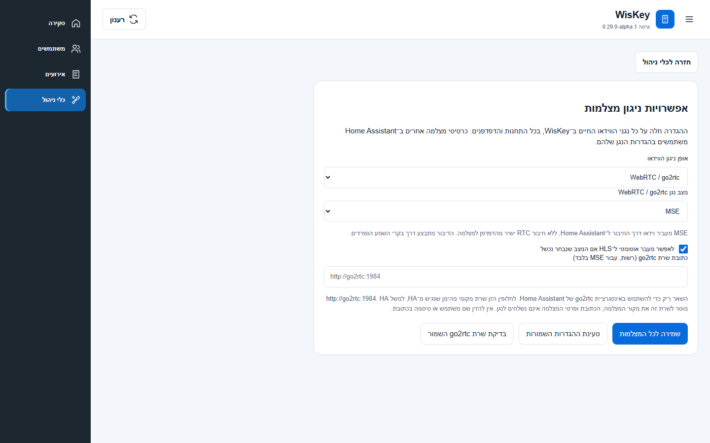

# WisKey 0.30 — אפשרויות וידאו גורפות ואבחון שמע

הגרסה מוסיפה **כלי ניהול ← אפשרויות ניגון מצלמות**. אפשר לבחור HLS או WebRTC/go2rtc,
ובתוך האפשרות השנייה RTC או MSE. הבחירה נשמרת ב־Home Assistant לכל התחנות והדפדפנים
של WisKey. שינוי הגדרה מעדכן גם נגנים פתוחים. תצוגות התמונות המקדימות נשארות תמונות;
כרטיסי מצלמה אחרים של HA משתמשים בהגדרות הנגן שלהם.

## שימוש

1. עדכן דרך HACS, אתחל את Home Assistant וטען מחדש את הממשק.
2. פתח **כלי ניהול ← אפשרויות ניגון מצלמות** ובחר את אופן הניגון.
3. עבור MSE, השאר כתובת ריקה אם אינטגרציית go2rtc של HA מוגדרת. אם משתמשים בשרת
   go2rtc עצמאי, הזן כתובת של שרת מקומי מהימן שנגיש מ־HA, למשל `http://go2rtc:1984`.
   שרת זה יקבל מ־HA את מקור ה־RTSP של המצלמה; אין להזין סיסמה או פרמטרים בכתובת.
4. שמור לכל המצלמות. הכפתור **בדיקת שרת go2rtc השמור** בודק את הכתובת שכבר נשמרה.
5. פתח מצלמה ובדוק את הכיתוב בנגן: RTC מוצג כ־WebRTC, ולצדו MSE או HLS לפי הניגון בפועל.

ברירת המחדל משמרת את ההתנהגות הקודמת: RTC עם מעבר ל־HLS במקרה של כישלון.
אפשר לבטל את המעבר האוטומטי; אז כישלון מוצג במפורש ולא מוחלף במצב אחר.
MSE משתמש בזרם fMP4 בינארי דרך החיבור המאומת ל־HA. אין צורך בחיבור RTC ישיר מהדפדפן
לציוד. הוא תומך בקידוד וידאו שהדפדפן יכול לפענח (H.264, ו־H.265 בדפדפנים תומכים);
שמע מהאינטרקום ודיבור מופעלים בנפרד בבקרי השמע. אין המרת קידוד אוטומטית.

## מה נבדק בציוד

- ב־2026-09-10, go2rtc ניהל משא ומתן ל־MSE מול שתי תחנות DS-KV6124-E1 בקושחה
  V3.9.0 build 260115 והחזיר זרם H.264 בינארי: 206,163 ו־293,062 בתים בחלונות הבדיקה.
  לא נשמרו תמונות או סרטון. [ראיות מסוננות](evidence/mse_transport_030.json).
- בשתי התחנות נפתחו במקביל ערוצי שמע ISAPI, התקבלו 32,000 בתים בכל תחנה ונשלחו
  30,880 ו־30,720 בתים של **שקט G.711 בלבד**. שני הערוצים נסגרו באישור, קריאות מצב
  השיחה המשיכו לפעול והגדרת הערוץ נשארה זהה. [ראיות](evidence/audio_transport_030.json).
- אין בכך אישור לקול שנשמע ברמקול. גם נתיב המיקרופון בדפדפן של בעל הפרויקט לא נבדק
  מקצה לקצה בהתקנת HA שלו: API ה־HA דורש הזדהות שלא הייתה זמינה לבדיקה זו.
- דיווח בעל הפרויקט: כתיבת/יצירת כרטיס, שיוך, עדכון ומחיקה עברו. תיעוד הקבלה עודכן;
  ריבוי כרטיסים בו־זמנית לאותו משתמש וביטול רישום מהקורא עדיין אינם מאושרים במפורש.

## דיבור ו־CGNAT

מסלול הדיבור הקיים הוא **מיקרופון בדפדפן → WebSocket מאומת של HA → ISAPI לתחנה**.
הוא אינו שולח את המיקרופון בחיבור RTC של הווידאו. לכן בעיית ICE/CGNAT יכולה להסביר
כישלון RTC, אך אין די בכך כדי להסביר היעדר דיבור. בדיקות התעבורה מוכיחות נגישות
מהמחשב הבודק לתחנות; הן אינן מוכיחות שמיעה או את נתיב הרשת מתוך HA המותקן.

לדיבור יש לפתוח את HA בהקשר מאובטח, בדרך כלל **HTTPS**, לאפשר מיקרופון לאתר,
ללחוץ **הפעל שמע** ואז להחזיק את כפתור הדיבור. HTTP לכתובת רשת פרטית אינו מקנה
כשלעצמו הרשאת מיקרופון מאובטחת. אין לכבות בדיקות אבטחה בדפדפן כפתרון.

הרחב **הורדת אבחון שמע** בחלון המצלמה:

- אות המיקרופון ומספר החבילות שאושרו ב־HA עוזרים להבחין בין קלט שקט לחוסר תעבורה.
- הודעות נפרדות מסבירות הרשאה שנדחתה, מיקרופון חסר/תפוס או כשל במעבד המיקרופון.
- הדוח כולל מצב הקשר מאובטח, שלב המיקרופון, קצב דגימה, מוני קבלה/שליחה והשמטה,
  ומוני השרת כשהוא נגיש. מונה כלל התעבורה כולל שקט שנוצר לשמירת החיבור; מונה
  הבתים מהמיקרופון נספר בנפרד לאחר כתיבה לתעבורה. אף מונה אינו מהווה אישור שמיעה.
- אין בדוח קול, PIN, כרטיס, כתובת מצלמה, פרטי התחברות או מזהה ערוץ שמע.

## תכנון ובדיקות תוכנה

ההגדרות נשמרות בקובץ אחסון נפרד, עם שמירה אטומית ומספר עדכון המונע דריסה בין מנהלים.
העדפת העיצוב נותרת כפי שהייתה. כל מסך ו־API חדש מוגבלים למנהל.
גשר MSE מגביל פתיחות במקביל, הודעות, זמני המתנה ומאגרי וידאו; סגירה, הסתרת הדף,
ניתוק HA, שינוי הגדרה או ביטול הרשאה משחררים חיבורים. תשובות שרת גולמיות אינן מוחזרות
לדפדפן מפני שהן עשויות לכלול כתובת מקור עם פרטי גישה.

בדיקות כוללות אחסון וכשל כתיבה, התנגשות בין מנהלים, הרשאות HA, כתובת חתומה,
משא ומתן בינארי וסגירת הגשר, פענוח fMP4 אמיתי של וידאו סינתטי בדפדפן, מעבר ל־HLS
וביטול מעבר, שינוי גורף בזמן צפייה, מצבי כשל מיקרופון, מוני AudioWorklet והתאמה
לרוחבי 360/768/1440 פיקסלים בעברית. צילום המסך נוצר מנתוני הדגמה בלבד.

תוצאות השחרור יירשמו לאחר השלמת הבדיקות והפרסום.

מקורות הממשק שנבדקו: [go2rtc MSE](https://github.com/AlexxIT/go2rtc/blob/master/internal/mp4/ws.go),
[נגן go2rtc](https://github.com/AlexxIT/go2rtc/blob/master/www/video-rtc.js),
[go2rtc ב־HA 2026.9.1](https://github.com/home-assistant/core/blob/2026.9.1/homeassistant/components/go2rtc/__init__.py),
[דרישות מיקרופון בדפדפן](https://developer.mozilla.org/en-US/docs/Web/API/MediaDevices/getUserMedia).
חוזה ISAPI לשמע נשאר כפי שאומת ב־[0.26](AUDIO_026_HE.md), ללא שינוי תצורת מכשיר או השערת פקודות חדשות.
