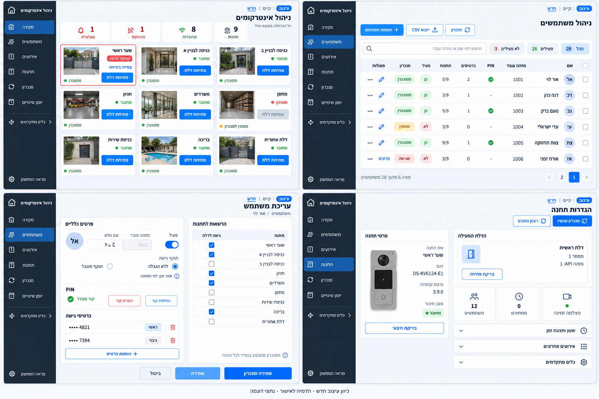
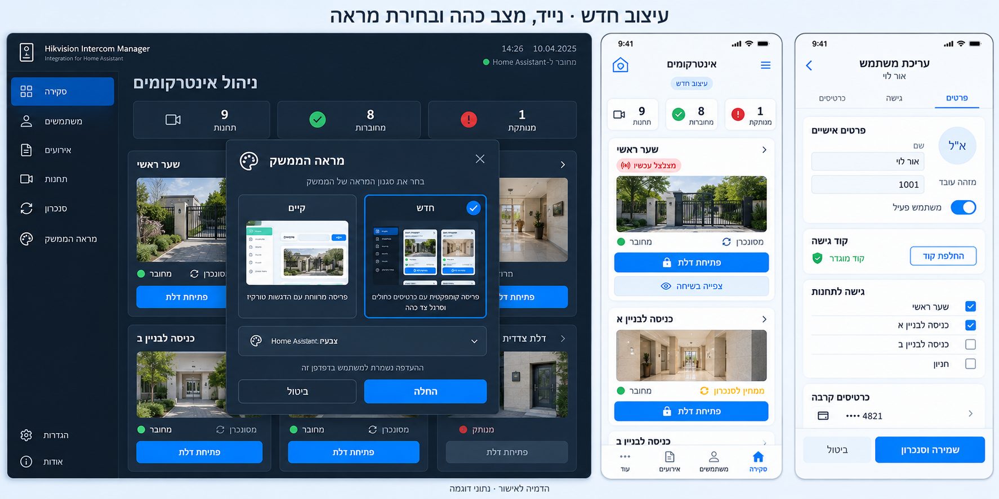

# עיצוב חלופי למערכת — הצעה לאישור

תאריך: 2026-09-10. בסיס המוצר: 0.27.7-alpha.1, קוד `fc70d20`.
מצב: **הדמיה ותכנון בלבד, לפני מימוש**. הבעלים ביקש לבחון את העיצוב תחילה,
ולאחר סיום שלב זה לחזור לפיתוח. הגרסה המותקנת לא משתנה במסגרת ההצעה.

## בקשת הבעלים והמקור

נבחנה התמונה `ChatGPT Image Sep 10, 2026, 09_42_15 AM.png`, הכוללת ארבעה מסכים:
סקירת אינטרקומים, רשימת משתמשים, עריכת משתמש והגדרות תחנה. התמונה היא השראה
לעיצוב; היא אינה משנה את היכולות המאומתות, הרשאות המערכת או היקף הממסרים.
התמונה המקורית כוללת פרטי דוגמה שנמסרו על ידי הבעלים ולכן אינה מועתקת למאגר הציבורי.
ההדמיות החדשות משתמשות בנתונים ובתמונות סינתטיים.

דרישת המוצר החדשה: **אפשר לבחור בין העיצוב הקיים לעיצוב החדש**. הבחירה אינה מחליפה
את התכונות, הנתונים, הסנכרון או ההרשאות; אותו מנגנון תוכנה יפעיל את שתי התצוגות.
הבקשה הנוכחית מאשרת הכנת הדמיות ותיעוד. מימוש העיצוב יתחיל לאחר משוב ואישור הבעלים.

## עקרונות מההדמיה והתאמתם למערכת

| מה רואים במקור | ההצעה למערכת |
| --- | --- |
| סרגל צד כהה ומשטח עבודה בהיר | ניווט פנימי של האינטגרציה בצבע פחם/כחול כהה, לצד תוכן בהיר וקומפקטי. לא בונים מחדש את סרגל HA החיצוני. |
| כחול מוביל ופעולות ברורות | פעולה ראשית אחת לכל הקשר; פעולות משניות בגבול דק או בתפריט. שמירה, סנכרון ופתיחת דלת נשארים מובחנים. |
| כרטיסי מצלמה קטנים | רשת של תשע תחנות; תמונה רחבה, שם, זמינות וכפתור לממסר הפעיל. צפיפות תשתנה לפי רוחב המסך. |
| טבלת משתמשים צפופה | שם ומזהה, PIN מוגדר, מספר כרטיסים, שיוכים, פעילות וסנכרון; בנייד כרטיסי משתמש. |
| עריכה בשתי עמודות | פרטים ותעודות בצד אחד, הרשאות לתחנות בצד השני; פעולות שמירה בתחתית קבועה. |
| מסך תחנה עם פרטים וכרטיסי סיכום | מצב וחיבור, הדלת הפעילה, סנכרון ומצלמה; שעון וכלי אבחון נפתחים לפי צורך. |
| שתי דלתות בחלק מהדוגמאות | בפרויקט אושר ממסר אחד פעיל לכל תחנה. ההדמיה והפיתוח מציגים הרשאה וכפתור אחד בלבד. |
| נקודות/עין בשדה PIN | PIN שמור יוצג כ״קוד מוגדר״. החלפה דורשת הזנת קוד חדש ואימות; אין חשיפת קוד שמור. |
| תמונה אישית ומספרי כרטיסים | עיגול עם ראשי תיבות ללא מערכת העלאת תמונות חדשה; מספרי כרטיסים ממוסכים. |
| סימון NFC בכרטיס | מוצגים כרטיסי הגישה הנתמכים. אין בכך התחייבות לתמיכה בטלפון NFC. |

## ארבעת המסכים המוצעים

### סקירה

כותרת וסיכום מצומצם: 9 תחנות, 8 מחוברות, אחת מנותקת ואחת מצלצלת (נתוני דוגמה).
כרטיס מצלמה כולל שם, מצב חיבור, מצב סנכרון נפרד וכפתור ״פתיחת דלת״. התחנה המצלצלת
תקבל מסגרת ותווית, וקיצור לצפייה בשיחה. פעולת תחנה אחת אינה משביתה כפתורים של תחנות אחרות.
כשל תמונה יוצג לפי הגורם הידוע; זמינות המצלמה אינה הוכחה לזמינות הממסר ולהפך.
כתובות, גרסאות ופרטי API עוברים לפרטי התחנה. במחשב רחב יוצגו 3–5 עמודות בהתאם לרוחב
הפאנל בפועל; בנייד עמודה אחת נוחה ללחיצה, ולא הקטנה של כל רשת המחשב.

### משתמשים

פעולה ראשית ״הוספת משתמש״, חיפוש בולט וכלי ייבוא/סנכרון משניים. רשימת המשתמשים כוללת
מספר שיוכים מתוך התחנות הזמינות, פעילות וסנכרון כשני מצבים שונים. שגיאה מקבלת קישור
לפרטים ולפעולת הבירור הקיימת. מחיקה בתפריט משני עם האישור הקיים. סרגל פעולה קבוצתית
מופיע לאחר בחירה מפורשת, ומציג מספר משתמשים והיקף תחנות לפני סקירה ואישור.
מסננים, מיון ודפדוף בתצוגה נשענים על הנתונים שכבר קיימים; לא ממציאים תוצאת סנכרון.

### עריכת משתמש

עריכה מרווחת יותר בשתי עמודות במחשב, עם עוגני סעיפים בנייד: פרטים, PIN, כרטיסים והרשאות.
ללא הגבלת תוקף כברירת מחדל לפי הרשומה; כאשר בוחרים תוקף מוגבל מוצגים אזור הזמן והגבולות.
רשימת התחנות מציגה הרשאה אחת לדלת הפעילה, בחירה ברורה וסטטוס סנכרון נפרד.
הפעולות ״ביטול״, ״שמירה״ ו״שמירה וסנכרון״ משתמשות בהתנהגות הקיימת, כולל זיהוי שינוי
מקביל והתאוששות מתשובה שלא התקבלה. סרגל השמירה נשאר גלוי בלי להסתיר שדות.

### תחנה

שם, דגם וחיבור בסיכום; פרטי זהות מתקדמים נפתחים בנפרד. הדלת הפעילה מופיעה עם השם
והמיפוי המאומת. שינוי תצורה יפנה למסלול HA הקיים במקום ליצור מסלול כתיבה מקביל.
״בדיקת פתיחה״ היא פעולה פיזית מפורשת עם מנגנון האישור הקיים. סיכומי משתמשים, המתנה
ומצלמה מובילים למסכים הרלוונטיים. שעון, אירועים ואבחון נשארים בקבוצות נפתחות.
אין להציג לחצן מענה או סימון WebRTC פעיל אלא כשהמצב והיכולת הקיימים מאפשרים זאת.

## בחירה בין העיצובים

- ב״מראה הממשק״ מוצגים שני כרטיסי בחירה עם תצוגות מקדימות: **קיים** ו־**חדש**.
  קיצור בראש הפאנל מאפשר להגיע לבחירה גם בלי לחפש בתפריט.
- משתמשים קיימים נשארים בעיצוב הקיים עד לבחירה מפורשת. בחירה בעיצוב החדש ניתנת לביטול.
- הצעה לשמירה: העדפה לפי משתמש HA ובדפדפן הנוכחי. הממשק יציין זאת; מעבר בין מכשירים
  אינו מוצג כאילו כבר סונכרן. אין צורך בסכמה חדשה של מאגר ההרשאות או בפנייה לציוד.
- מצב הצבעים נפרד מהעיצוב: שתי החלופות תומכות בבהיר ובכהה לפי ערכת HA. החלפת עיצוב
  אינה משנה את ערכת הנושא הכללית של Home Assistant.
- החלפת עיצוב תשמור את המסך, המסננים, בחירת המשתמשים והטיוטה הפעילה. לא נשלחות בעקבותיה
  פקודות פתיחה, שמירה או סנכרון. פעולות ממתינות נשארות משויכות לתחנה ולמזהה הפעולה.
- מעטפת HA החיצונית נשארת באחריות HA. בעיצוב החדש מוצע ניווט האינטגרציה בצד שמאל,
  כבתמונת ההשראה, עם תוכן ושדות RTL; מיקום זה לבחינת הבעלים בשלב ההדמיה.

## שפה חזותית מוצעת

פחם `#1C2730` לניווט; כחול `#0874E8` לפעולה ראשית; רקע `#F3F6FA`; משטחים לבנים;
טקסט `#142133`; גבולות `#DCE4EE`. אלה ערכי תכנון, לא דגימת צבע מחייבת מהתמונה.
רדיוס 8–12 פיקסלים, ריווח במדרגות 4/8/12/16/24, טיפוגרפיית מערכת מקומית התומכת בעברית.
צבעי בהיר/כהה ימומשו כמשתנים סמנטיים, תוך שימוש במשתני HA כשמתאים.
מגע בנייד לפחות 44 פיקסלים, פוקוס נראה, תוויות לפעולות איקון ומצב שאינו מסתמך על צבע בלבד.
ניגודיות וגלישה ייבדקו במימוש; הדמיה גרפית אינה ראיית נגישות או צילום של מוצר פעיל.

## שלבי העבודה בתוך מסלול C של התוכנית הקיימת

| מזהה | שלב | מצב נוכחי | תנאי סיום |
| --- | --- | --- | --- |
| C-ALT-01 | ניתוח ארבעת המסכים והיכולות הקיימות | הושלם | עקרונות, התאמות והחרגות מתועדים במסמך זה. |
| C-ALT-02 | הדמיות מחשב, נייד, כהה ובחירת עיצוב | הושלם — ממתין למשוב | תמונות עקביות, נתוני דוגמה והערות לבחינה. |
| C-ALT-03 | משוב ואישור הכיוון | ממתין לבעלים | בחינת צפיפות, ניווט, עריכה ובורר העיצוב; תיקון ההדמיה לפי המשוב. |
| C-ALT-04 | תשתית שתי חלופות ושמירת העדפה | מתוכנן לאחר האישור | הקיים כברירת מחדל, בחירה נשמרת, ללא שינוי נתונים או שליחת פקודות. |
| C-ALT-05 | סקירה, מצלמה ושיחה בעיצוב החדש | מתוכנן | אותה לוגיקה של תחנות/מדיה; תצוגה צפופה ועצמאות פעולות. |
| C-ALT-06 | משתמשים ועריכה | מתוכנן | טבלה/כרטיסים, הרשאות, PIN וכרטיסים ושמירה מלאה של היכולות. |
| C-ALT-07 | תחנות, אירועים, סנכרון ויומן | מתוכנן | שפה אחידה, ניווט לבירור בעיות ושימור הכלים הקיימים. |
| C-ALT-08 | כלים מתקדמים והשלמת שתי החלופות | מתוכנן | נגישות לאבחון ולתכנון בשתי התצוגות, ללא שכתוב מנגנוני ISAPI. |
| C-ALT-09 | בדיקות שימוש, נגישות ורגרסיה | מתוכנן | 390/768/1440, RTL/LTR, בהיר/כהה, החלפה עם טיוטה/וידאו/פעולה ממתינה. |
| C-ALT-10 | תיעוד ופרסום | מתוכנן | גרסה סמנטית מתאימה, CHANGELOG, בדיקות שחרור, GitHub Release ו־HACS. |

המשימות הן הרחבה של מסלול עיצוב C, לא Phase חדש במפרט. אין שינוי במכנה הקבלה או
במדדי 31/38 ו־37/47 עקב יצירת הדמיה. לאחר קיבוע הכיוון נחזור לפיתוח לפי סדר זה,
לצד התלויות הפיזיות שנותרו בדוח סגירת פערי התוכנה.

## יומן תהליך וראיות

1. נבחנה תמונת הבעלים על ארבעת מסכיה; נבדקו תיעוד העיצובים 0.24/0.25, תוכנית 95%
   ורכיבי הניווט והסגנונות של 0.27.7. לא שונו רכיבי מוצר במסגרת הסקירה.
2. הוגדרו התאמות לממסר יחיד, סודות, מצבי סנכרון והפרדת מראה מערכות צבע.
3. קריאת קובץ המקור על ידי כלי התמונה נכשלה בגלל עוזר sandbox של Windows. התמונה
   נבחנה כפי שצורפה לשיחה; שתי ההדמיות נוצרו בכלי ImageGen המובנה מתיאור מפורט שלה,
   ללא העברת קובץ המקור לכלי וללא מסלול API/CLI חלופי. [הנחיות היצירה](IMAGE_PROMPTS.md).
4. נבחנו שתי התוצאות: תשע תחנות בלוח המחשב, ממסר יחיד, כרטיסים ממוסכים, PIN כסטטוס,
   מצבי חיבור וסנכרון נפרדים, בחירה בין מראות ותצוגות נייד/כהה. ההצעה דומה לסגנון המקור.
5. נשמרו הקבצים הסופיים ופרטי היצירה ב־Git. לא שונו קובצי frontend, חבילת הפאנל,
   גרסה, תצורת תחנה או נתוני משתמשים. לא נוצר GitHub Release לעיצוב שטרם מומש.

## ההדמיות שנמסרו

### מחשב — ארבעת המסכים

[פתיחת ההדמיה בגודל מלא](images/alternate-desktop-v1.png).

### נייד, מצב כהה ובחירת עיצוב

[פתיחת ההדמיה בגודל מלא](images/alternate-mobile-dark-v1.png).

### הערות לסקירה ולמימוש

- אלה הדמיות שנוצרו בבינה מלאכותית; טקסטים קטנים, סימנים, פריסת עמודות ושמות עשויים
  לכלול אי־דיוקים. המימוש יהיה טקסט HTML אמיתי, לפי מילון התרגום והנתונים המאומתים.
- התצוגה הממוזערת ״קיים״ בבורר ממחישה את הסגנון הקיים; היא אינה צילום מדויק שלו.
  תמונות הממשק הקיים זמינות בתיעוד 0.24/0.25 המקושר למטה.
- בכרטיס תחנה מנותקת, במימוש תופיע ״אין חיבור״ או תמונה אחרונה עם סימון הזמן ומקור
  התמונה. צילום בהדמיה אינו מרמז שמצלמה מנותקת ממשיכה לשדר.
- הרשת בלוח המחשב משתמשת בכרטיסים קומפקטיים עם תמונה לצד הפרטים. במצב רחב מספיק
  ניתן להציג תמונה מעליהם, כפי שמופיע בתמונת ההשראה ובדוגמת הנייד; הצפיפות לבחירת הבעלים.
- סרגל הנייד והעורך הקבוע הם כיוון UX לבחינה. בדיקות פוקוס, מגע, ניגודיות והיעדר חפיפה
  יבוצעו רק לאחר המימוש, בשתי החלופות ובכל גדלי המסך המתוכננים.
- משוב מבוקש בשלב הבא: גודל תמונות התחנות וצפיפותן, מיקום הניווט, חלוקת מסך העריכה
  והנוחות של בורר קיים/חדש. אין צורך בבדיקת ציוד כדי לבחון את הכיוון.

## קישורים

- [תוכנית 95% והעיצוב](../ROADMAP_95_AND_UI_HE.md)
- [מסירת הממשק הקיים 0.24](../CORE_UI_024_HE.md)
- [מסירת מסכי הניהול 0.25](../ADMIN_UI_025_HE.md)
- [מצב הפיתוח והקבלה לפני העיצוב](../SOFTWARE_CLOSURE_0277_HE.md)
