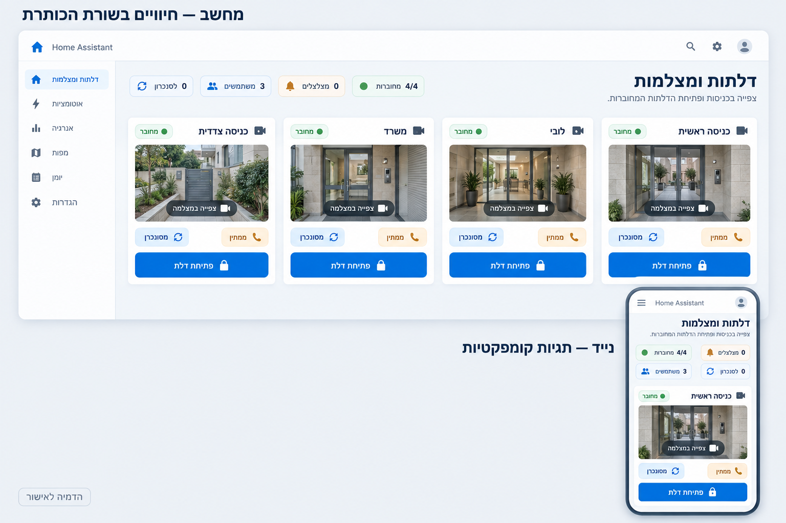

# כותרת סקירה קומפקטית — הדמיה לאישור

תאריך: 2026-09-10. בסיס: v0.28.0-alpha.1.
מצב: הדמיה בלבד; המימוש ממתין לאישור הבעלים, לפי בקשתו המפורשת.

## הבקשה

לצמצם מהותית את שורת סיכומי התחנות, הצלצולים, המשתמשים והסנכרון, ולהעביר את
החיוויים לשורת הכותרת ״דלתות ומצלמות״. התמונה שצורפה לבקשה שימשה לעיון בלבד.

## ההצעה

- במחשב: כותרת בצד ימין וארבע תגיות קטנות באותה שורה, משמאל. כל תגית מכילה
  סמל קטן, מספר ותווית קצרה, בשורה אחת. גובה מתוכנן: כ־30–34px.
- דוגמאות: ״4/4 מחוברות״, ״0 מצלצלים״, ״3 משתמשים״, ״0 לסנכרון״. אלה אותם
  ארבעה מדדים; מספר התחנות המחוברות אינו מוצג כמספר זרמי וידאו פעילים.
- כותרת המשנה נשארת מתחת לכותרת, ורשת המצלמות מתחילה מיד מתחת לאזור הכותרת.
- בטאבלט: השורה נעטפת לפי הרוחב הפנוי. בנייד: הכותרת מעל שתי שורות קצרות של תגיות,
  שתי תגיות בשורה כשיש מקום, ללא גלילה אופקית או טקסט חתוך.
- שימור עברית/אנגלית, בהיר/כהה, תוויות נגישות וסדר תקין של מספרים כגון 4/4.
- אין שימוש בתגיות ככפתורים חדשים; אלה חיוויי מידע. בחירת העיצוב ממשיכה להישמר.

ההדמיה ממחישה את אזור הכותרת. תמונות התחנות, מעטפת Home Assistant וחלק מפרטי
הכרטיסים בתמונה נוצרו להמחשה ואינם הצעה לשינוי נוסף של רכיבי המוצר.
המימוש המאושר העתידי יוגבל לכותרת ולסיכומים בעיצוב החדש.

## שלבי ההמשך

| שלב | מצב | תוצר |
| --- | --- | --- |
| סקירת צילום המסך והבקשה | הושלם | הגדרת צמצום סיכומים ושילוב בכותרת |
| הדמיית מחשב ונייד | הושלם | התמונה המקושרת למעלה |
| אישור הבעלים | ממתין | אישור ההצעה או תיקון כיוון |
| מימוש כותרת ותגיות | לאחר אישור | פריסה לפי רוחב הפאנל, ושימור המדדים והנתונים |
| בדיקות ותיעוד | לאחר מימוש | רוחבים משתנים, RTL/LTR, כהה/בהיר ומספרים ארוכים |
| גרסה ופרסום | לאחר בדיקות | SemVer, CHANGELOG, GitHub Release ו־HACS |

## תהליך היצירה

נעשה שימוש בכלי ImageGen המובנה. ניסיון להזין את קובץ צילום המסך ישירות נכשל בגלל
שגיאת עוזר sandbox של Windows. לאחר עיון בתמונה המוצגת בשיחה נוצרה ההדמיה החדשה
מתיאור טקסטואלי, ללא קובץ מקור מצורף לכלי. לא נעשה שימוש ב־CLI או ב־API חלופי.
[הנחיית היצירה הסופית](COMPACT_HEADER_PROMPT.txt).

לא שונו קובצי המימוש או חבילת הפאנל, ולא שונתה גרסת המוצר במסגרת שלב ההדמיה.